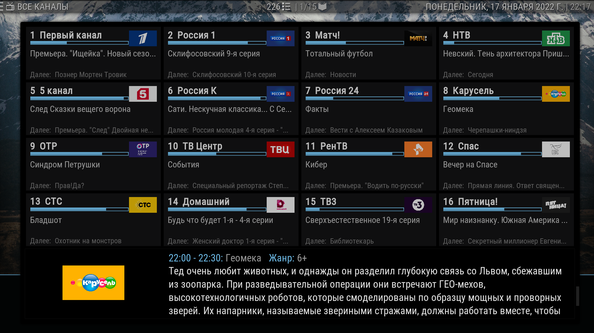

# dev-cdmm / iptv.smotreshka

PHP скрипт генерации IPTV плейлиста `m3u8` и телепрограммы `xmltv` для сервиса [Smotreshka.tv](https://smotreshka.tv).

## Features

* Совместимость с плагином Kodi : PVR IPTV Simple Client
* Поддержка EPG
* Логотипы и категории телеканалов

## Requirements

* php 7.4 +
* curl
* gzip

## Usage

1. Добавить данные авторизации для своего аккуанта в `index.php` и `xmltv/index.php`

  		initSmotreshka("login","password","index.m3u8");

2. Пример URL плейлиста и телепрограммы для домена `iptv.domain`
     * http://iptv.domain/
     * http://iptv.domain/xmltv/

## Issues
> Smotreshka использует IP адрес клиента для создания уникального token каждого канала. 
> IP адрес с которого будет осуществлен просмотр должен быть идентичным IP адресу с которого происходила генерация плейлиста.